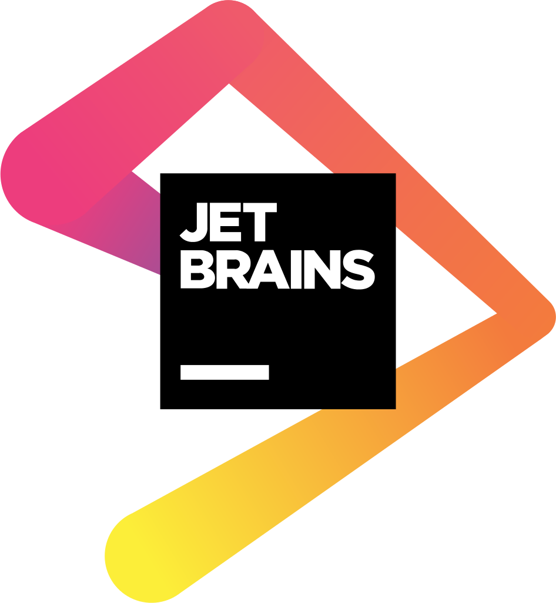

  <h1 align="center"><b>Hello there, I'm Jerry 👋</b></h1>

 
&nbsp;
&nbsp;
&nbsp;

 

### I am a Systems Engineer Specialist at Infosys

- 🔭 I’m currently working on my Portfolio Website 😎
- 🌱 I’m currently learning Ruby and Rails. 💁
- 💬 Ask me about anything, I am happy to help 😀
- 📬 How to reach me: [Let's get in touch!][linkedin]

 

### Techno and Tools

 
 

 
 

 
 

 
 
 
 

  

 

  

<!--  -->

#### Thank You-🙏🏼

⭐️ From [micael-jerry](https://github.com/micael-jerry)

<!--[website]: -->
[instagram]: https://www.instagram.com/mickael_jerry/
[linkedin]: https://www.linkedin.com/in/micael-jerry-fidimalala-78a32a278/
